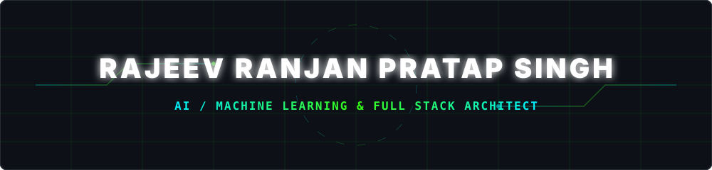
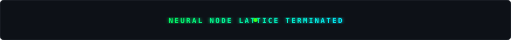

<p align="center">
  <!-- Cyber-Hacker & AI/ML Local Wave Header -->
  
</p>

<p align="center">
  <!-- Glowing Cyber Badges -->
  <a href="mailto:rajeevranjanpratapsinghj94@gmail.com">
    
  </a>
  <a href="https://www.linkedin.com/in/rajeev-ranjan-pratap-singh/">
    
  </a>
  <a href="https://github.com/RAJEEVRANJAN0001">
    
  </a>
</p>

<p align="center">
  <!-- Dynamic Typing SVG CLI Hacking Animation -->
  <a href="https://git.io/typing-svg">
    
  </a>
</p>

<br/>

<p align="center">
  <!-- Glowing Section Header 1: Terminal Core (Local SVG) -->
  
</p>

```yaml
▶ HOST_INITIALIZATION: COMPLETED // NEURAL_CORE_v2.0.8_ACTIVE
─────────────────────────────────────────────────────────────────────────────
ENGINEER:      "Rajeev Ranjan Pratap Singh"
COGNITIVE:     "Deep Learning (CNNs, LLMs) | Computer Vision (OpenCV, YOLO)"
HYPERTEXT:     "Full-Stack Web (React, NodeJS, Express, Javascript, CSS3, SQL)"
TELEMETRY:     "MLOps Pipeline Integrations | Real-Time Diagnostic Deployments"
STATUS:        "ACTIVE & INNOVATING // Ready for corporate sync operations"
```

---

<p align="center">
  <!-- Glowing Section Header 2: About Bios (Local SVG) -->
  
</p>


```python
class NeuralCore:
    def __init__(self):
        self.identity = "Rajeev Ranjan Pratap Singh"
        self.role = "Machine Learning & Full Stack Engineer"
        self.credo = "Synthesizing autonomous neural models with sleek visual frontends."
        
    def query_subsystems(self):
        return {
            "ml_pipelines": ["Computer Vision", "Real-Time Classification", "SpeechNLP"],
            "web_interfaces": ["ReactJS SPAs", "NodeJS / Express APIs", "SQL Databases"],
            "creativity_index": "100% Optimized // Building AI that solves human problems."
        }

core = NeuralCore()
print(core.query_subsystems()["creativity_index"])
```

*   [+] **Global Sector:** Actively architecting highly interactive web apps and AI modules.
*   [+] **Computational Credo:** Bridging advanced computational logic with human-centric interfaces.
*   [+] **Current Research:** Custom MLOps pipeline optimizations and fine-tuning Transformer networks.

---

<p align="center">
  <!-- Glowing Section Header 3: Projects (Local SVG) -->
  
</p>

<table width="100%">
<tr>
<td width="50%" valign="top">

### Emotion Recognition Core
`MODULE_01 // COMPUTER VISION`

> **Real-time expression classifier** using deep CNN networks to parse human emotion states live.

```yaml
● STATUS:         [ACTIVE INFERENCE]
● TELEMETRY:      "7 facial classes"
● SYSTEM FLOW:    [██████████████████░] 94%
```
**Specs & Frameworks:** `CNN` • `OpenCV` • `TensorFlow` • `Python`

<br/>

[](https://github.com/RAJEEVRANJAN0001/Emotion-recognition)

</td>
<td width="50%" valign="top">

### Brain Tumor Classifier
`MODULE_02 // CLINICAL HEALTH`

> **Medical MRI analyzer** designed to segment tissues and identify tumors with high precision.

```yaml
● STATUS:         [CLINICAL ACTIVE]
● TELEMETRY:      "95%+ accuracy"
● SYSTEM FLOW:    [███████████████████░] 95%
```
**Specs & Frameworks:** `95%+ Acc` • `MRI Scans` • `PyTorch` • `Python`

<br/>

[](https://github.com/RAJEEVRANJAN0001/brainTumor)

</td>
</tr>

<tr>
<td width="50%" valign="top">

### Diabetic Retinopathy Core
`MODULE_03 // CLINICAL COMPUTER VISION`

> **Automated retinal scan diagnostic** grading vascular changes across a 5-stage scale.

```yaml
● STATUS:         [STABLE DEPLOYMENT]
● TELEMETRY:      "DenseNet/ResNet core"
● SYSTEM FLOW:    [██████████████████░] 92%
```
**Specs & Frameworks:** `DenseNet` • `OpenCV` • `Keras` • `Python`

<br/>

[](https://github.com/RAJEEVRANJAN0001/Diabetic-Retinopathy-Classification)

</td>
<td width="50%" valign="top">

### Virtual Voice Assistant
`MODULE_04 // LANGUAGE ENGINE`

> **Speech automation platform** leveraging voice processing to execute commands and queries.

```yaml
● STATUS:         [ONLINE & READY]
● TELEMETRY:      "Real-time NLP"
● SYSTEM FLOW:    [████████████████████] 100%
```
**Specs & Frameworks:** `SpeechNLP` • `Automation` • `Python`

<br/>

[](https://github.com/RAJEEVRANJAN0001/VIRTUAL-VOICE-ASSISTANT)

</td>
</tr>
</table>

---

<p align="center">
  <!-- Glowing Section Header 4: Live Telemetry Stats (Local SVG) -->
  
</p>

<p align="center">
  <!-- Custom dynamic glowing cards with neon colors -->
  <a href="https://github.com/RAJEEVRANJAN0001">
    
  </a>
  <a href="https://github.com/RAJEEVRANJAN0001">
    
  </a>
</p>

---

<p align="center">
  <!-- Glowing Section Header 5: Skills Stack (Local SVG) -->
  
</p>

<div align="center">

### Cognitive & Machine Learning Layers
<p>
  
  
  
  
  
  
</p>

### Hypertext Core & Web Ecosystem (Full Stack)
<p>
  
  
  
  
  
  
  
  
  
</p>

### System Control & Operations (DevOps)
<p>
  
  
  
  
  
  
</p>

</div>

---

<p align="center">
  <!-- Glowing Section Header 6: Snake Game (Local SVG) -->
  
</p>

<p align="center">
  <!-- Contribution Snake Grid SVG -->
  
</p>

<p align="center">
  <b><i>Watch the digital snake traverse my commit coordinates live on the grid!</i></b>
</p>

---

<p align="center">
  <!-- Glowing Section Header 7: Goals (Local SVG) -->
  
</p>

```javascript
const currentGoals = {
    analyzing:  ["Large Language Models", "MLOps Automation Pipelines", "Edge Computing AI"],
    building:   ["Intelligent Clinical AI Interfaces", "Futuristic React Full-Stack Platforms"],
    exploring:  ["Reinforcement Learning Agents", "Federated Decentralized Architectures"],
    synergy:    "Ready to sync on advanced Machine Learning & Secure Full-Stack software deployments"
};
```

---

<p align="center">
  <!-- Glowing Section Header 8: Connect (Local SVG) -->
  
</p>

<table width="100%">
<tr>
<td align="center" width="33%">

Email Terminal

<br/>

[](mailto:rajeevranjanpratapsinghj94@gmail.com)

</td>
<td align="center" width="33%">

LinkedIn Node

<br/>

[](https://www.linkedin.com/in/rajeev-ranjan-pratap-singh/)

</td>
<td align="center" width="33%">

GitHub Source

<br/>

[](https://github.com/RAJEEVRANJAN0001)

</td>
</tr>
</table>

---

## Pinned Repositories

<p align="center">
  <a href="https://github.com/RAJEEVRANJAN0001/Emotion-recognition">
    
  </a>
  <a href="https://github.com/RAJEEVRANJAN0001/brainTumor">
    
  </a>
</p>

<p align="center">
  <a href="https://github.com/RAJEEVRANJAN0001/Diabetic-Retinopathy-Classification">
    
  </a>
  <a href="https://github.com/RAJEEVRANJAN0001/VIRTUAL-VOICE-ASSISTANT">
    
  </a>
</p>

---

<div align="center">

### "Innovation distinguishes between a leader and a follower." – Steve Jobs

<p align="center">
  <!-- Waving Cyberpunk Footer (Local SVG) -->
  
</p>

<p>
  
  
</p>

**Star the repositories if these diagnostic modules assist your workflows!**

</div>
